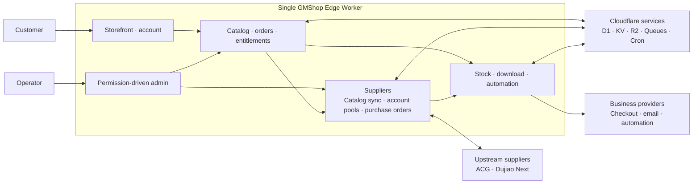

# GMShop Edge

**Digital goods, delivered from the edge.**

[简体中文](README.zh-CN.md) · English

[](LICENSE)
[](https://workers.cloudflare.com/)
[](https://bun.sh/)
[](https://www.typescriptlang.org/)
[](https://react.dev/)
[](https://tanstack.com/start)
[](https://developers.cloudflare.com/d1/)
[](https://www.better-auth.com/)
[](https://visulima.com/packages/email)
[](project.inlang/settings.json)

GMShop Edge is a self-hosted, single-deployment, single-tenant digital-goods
storefront for Cloudflare Workers. One deployment provides a responsive public
shop, customer accounts, checkout and fulfillment, and a permission-driven
administration console.

> [!IMPORTANT]
> GMShop Edge is under active development. A built-in adapter means that its
> integration path is implemented; production use still requires
> deployer-owned provider credentials, backups, monitoring, and real-provider
> acceptance tests.

## Core capabilities

- Sell stock products that atomically allocate encrypted preset text such as
  license keys, accounts, activation codes, or credentials.
- Synchronize upstream products from ACG `3.5.5` V4 Open API or Dujiao Next
  `v1.3.1`, then fulfill through an equal-priority account pool for each API
  source.
- Grant authorized, bounded access to private download files stored in R2.
- Dispatch automation products for deployments, scripts, resource provisioning,
  or build workflows, with `none | optional | required` artifact policies.
- Combine permanent, fixed-term, limited, unlimited, free, one-time, and
  customer-renewed entitlement policies without floating-point money.
- Support guest and registered checkout, private order lookup, coupons, refunds,
  after-sales handling, and operational retention.
- Keep one commerce identity model: registered ownership references Better Auth
  users directly, while guest orders use a verified checkout email until a
  matching verified account claims them. No shadow account or separate customer
  table is created.
- Deliver template-based transactional email through five `@visulima/email`
  providers—SMTP, Resend, Postmark, SendGrid, and Mailgun—plus the native
  Cloudflare Send Email binding. Email records retain delivery state while
  Queue/Cron provides bounded retries.
- Quote customer-selected fiat currencies from store-owned D1 exchange rates and
  pass one immutable quote to Stripe, GMpay, EPay, or another typed adapter.
- Configure email/password, social, OIDC, and Telegram authentication providers
  at runtime through Better Auth without rebuilding the Worker. Telegram web
  login supports both OIDC code callbacks and verified `#tgAuthResult` Widget
  fallback while storing the OIDC client secret separately from the Bot Token.
  Telegram Mini Apps use verified `initData` for automatic sign-up/sign-in,
  request full screen through `@tma.js/sdk`, and import a missing Telegram
  avatar. Telegram users can bind a verified email independently from setting
  a password.
- Synchronize a grammY webhook bot with localized shop commands and fixed Mini
  App buttons. Optional customer support maps each Telegram user to a Forum
  Topic, forwards messages in both directions without storing their content,
  trusts only current group administrators, and closes idle conversations.
- Protect `/admin` with dynamic multi-role RBAC, a non-removable root invariant,
  server-side permission checks, reauthentication, and audit records.
- Provide responsive light and dark themes, keyboard access, and two UI locales:
  English (`en-US`) and Simplified Chinese (`zh-CN`).
- Persist each user's preferred language for account and transactional email;
  guest orders retain the checkout locale as a notification fallback.

Every GMShop Edge capability listed above is part of the open-source project;
there is no closed Pro or Enterprise tier.

## Architecture



One Worker owns the public, customer, and administrative surfaces. D1 is
authoritative for identity, RBAC, catalog, money, orders, inventory,
entitlements, supplier accounts, product bindings, purchase orders, jobs,
replay protection, rate limits, outbox, and audit. KV holds only validated,
versioned, bounded upstream-catalog snapshots and read caches. R2 holds private
media, downloads, artifacts, and exports. Queues and Cron move catalog
synchronization, supplier purchasing and reconciliation, fulfillment, retries,
retention, and key rotation outside synchronous requests. The supplier module
synchronizes one catalog per provider and API source, automatically selects
from the eligible account pool for that source, and passes upstream content
through the unified delivery-record pipeline.

Routes remain thin; feature pages, schemas, server functions, and domain
behavior live in `src/features`, cross-domain runtime plumbing lives in
`src/server`, and the clean-install Drizzle baseline is
`drizzle/0000_gmshop.sql`.

## Deploy to Cloudflare Workers

GMShop Edge deploys as one Worker with D1, KV, private R2, one commerce Queue,
its dead-letter Queue, the optional Cloudflare Send Email binding, and Cron
Triggers.

### Deploy button

[](https://deploy.workers.cloudflare.com/?url=https://github.com/GMWalletApp/gmshop-edge)

The guided flow creates the Worker project from this repository. After it
finishes, open `/install`, verify the generated resource bindings, and complete
the production checklist before accepting orders.

### Deploy with Wrangler

Authenticate Wrangler, install dependencies, and deploy:

```bash
bun install
bunx wrangler login
bun run deploy
```

The `predeploy` hook creates or reuses the named D1, R2, and Queue resources,
applies the D1 baseline through `DB`, and builds the Worker. The build script
does not write account-specific IDs to `wrangler.jsonc`. Configure the `CACHE`
KV namespace and, when used, the `EMAIL` binding in the Cloudflare deployment
environment.

After deployment, open `/install` on the Worker URL to initialize the instance.
Provider secrets are entered through the administration console and must never
be committed.

## Keep a fork synchronized

Forks include the `Sync upstream` GitHub Actions workflow. It runs every day at
00:00 and 12:00 UTC and can also be started manually from **Actions → Sync
upstream → Run workflow**. The workflow discovers the fork's parent repository
and merges the upstream default branch into the fork's default branch using
GitHub's fork sync API.

After creating a fork, open its **Actions** tab and enable workflows; GitHub
disables workflows in a new fork until its owner opts in. The workflow requests
only `contents: write` access from the repository `GITHUB_TOKEN` and does not
require a personal access token. It never force-pushes or overwrites fork-only
commits. A merge conflict fails the run and must be resolved manually before
automatic synchronization can continue.

## Quick start

### Requirements

- [Bun](https://bun.sh/) 1.3 or later
- A local environment supported by
  [Wrangler](https://developers.cloudflare.com/workers/wrangler/)

Install dependencies and start the local development server:

```bash
bun install
bun run dev
```

`bun run dev` applies pending migrations to the local `gmshop-edge` D1 database
and starts the application at <http://localhost:3000>. It does not migrate a
remote database.

Open <http://localhost:3000/install> on the first run. Installation creates the
first root administrator, protected built-in roles, runtime secrets, and
required settings. It does not create fake products, inventory, provider
credentials, or payment configurations.

After installation:

1. Confirm the detected application URL and configure exact Allowed Hosts.
2. Configure public branding, registration, authentication, email, commerce,
   fulfillment, retention, and provider settings in `/admin`.
3. Create a draft product, its sellable items, and stock, files, or automation
   configuration; review publish checks before making it public.
4. Configure a payment adapter and complete a real-provider acceptance order
   before opening the store.
5. Back up D1, private R2 data, and the runtime configuration.

## Technology stack

| Area | Technology |
| --- | --- |
| Runtime | Cloudflare Workers |
| Application | React 19, TanStack Start/Router/Query/Table/Form |
| UI | Tailwind CSS 4, shadcn/Radix |
| Authentication | Better Auth |
| Authorization | Project-owned dynamic RBAC with permission bit masks |
| Data | Cloudflare D1, Drizzle ORM |
| Edge services | KV, R2, Queues, Cron Triggers, Send Email |
| Internationalization | ParaglideJS |
| Tooling | Bun, strict TypeScript, Zod, Vitest, Biome, Wrangler |

## Development and quality

Common development commands:

```bash
bun run dev
bun run db:migrate:local
bun run generate-routes
bun run typecheck
bun run test
bun run check
bun run build
```

After installing a local instance, populate idempotent acceptance fixtures with:

```bash
bun run seed:local
```

The fixtures cover products, stock, payment channels, customer orders and
entitlements, plus three supplier accounts across both supported platforms,
three bindings, three supplier-order states, and local catalog snapshots with
unimported SKUs for testing the all-sources list and bulk import. Orders and
entitlements belong to the installed `root@example.com`, whose local test password is reset to
`root@example.com`. Supplier accounts are
disabled, their API origins use `.example.invalid`, and automatic
synchronization remains off, so the seed cannot contact a real upstream.
The command also writes product media, downloads, automation artifacts, and
creates the local Telegram test user through the Telegram Mini App auto-sign-in flow.
Replace the credentials and explicitly enable accounts in the admin console for
integration testing. The script accepts `--local` only, preserves existing
rows, and cannot write to a remote D1 database.

Use `bun run db:generate` only when intentionally changing the Drizzle schema,
then review the generated migration. Normal development applies migrations; it
does not regenerate the clean-install baseline.

Before submitting a completed change, run the final quality gate on the same
working tree:

```bash
bun run typecheck
bun run test
bun run check
bun run build
```

Deterministic automated tests cover application behavior. Real payment, email,
Telegram, and automation-provider smoke suites remain manual and
unconditionally skipped; production acceptance must use deployer-owned
infrastructure.

## API contract

The machine-readable application HTTP contract is available as
[OpenAPI YAML](public/openapi.yaml).

## Security

- Never commit `.dev.vars`, provider credentials, runtime secrets, private keys,
  or Cloudflare credentials.
- Configure exact Allowed Hosts, HTTPS, Origin and CSRF checks, rate limits,
  Queue/DLQ monitoring, administrator recovery, and backups before production.
- Private R2 objects are resolved through authorized D1 records; clients never
  choose object keys.
- Money is stored as decimal integer strings in minor units and never computed
  with floating point.
- Back up D1 and R2 before schema or retention changes, and test recovery rather
  than treating backups as complete when they have not been restored.

## License

GMShop Edge is licensed under [GPL-3.0-or-later](LICENSE).
